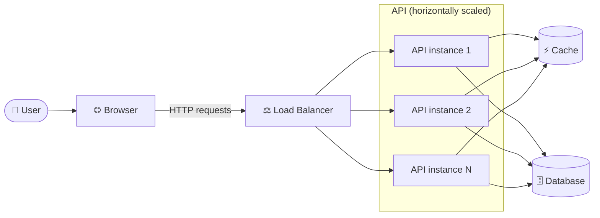

# URL Shortener

An application that allows users to shorten URLs.

Its capabilities include:

1. URL shortening
2. Redirect to original URL
3. Short URL expiration
4. Short URL click rate (how many times they're used)

## Scale assumptions

- 100M URLs generated per day
- 10:1 reads to writes ratio

This implies that our RPS target should be:

1. $100000000 / 24 / 3600 \approx 1160$ URL shortening operations per second
2. $1160 \times 10 = 11.6 \text{k}$ URL redirects per second 

## API Design

The API will need the following routes:

1. **Shorten URL**: 
    - `POST /api/v1/url`
    - Example body: `{"long_url": "..."}`
    - Example response: `{"short_url": "..."}`
2. **Redirect**:
    - `GET /api/v1/url/{id}`
    - HTTP status 302 (temporary) redirect to have click rate (permanent redirect means the browser caches the long url and no request is sent to the servers -> less load but can't estimate click rate)

## URL Shortening

For URL shortening, let's first try to understand the number of URLs we'll need to end up storing. Assuming the tool runs for around 10 years, we get:

$100 \text{M} \times 365 \times 10 = 365 \text{B}$ urls

So... 365 billion URLs.

Let's assume we only use alphanumeric characters to represent our short urls. This means we have $10 + 26 + 26 = 62$ characters in our vocabulary.

If our short urls are $N$ characters long, then we can create $62^{N}$ different URLs!

To get that number to 365 billion, we need at least $N = \lceil \log_{62} \left( 365 \text{B} \right) \rceil = 7$ characters.

If we use hashing functions, pretty much all of them output more characters than we need. However, hashing functions also come with collision probabilities. Let's explore that trade-off.

### Hashing functions

We can use hashing functions to generate IDs for this system, but we need to be careful with **hashing collisions**.

When a collision happens, we can simply **append a string to the long url and try to hash it again**, but since we'd need to check if the hash matches any other hash, this would mean a round-trip to our database, which is expensive.

So, we want to have as little chance of hashing collisions as possible. A good way of evaluating this in hashing functions is the 50% chance threshold - which is related to the **Birthday Paradox**.

The 50% chance threshold of a hash function answers the following question: how many random inputs do I need to hash until there is a 50% chance of at least 2 hashes colliding?

- **CRC-32** outputs 32 bits, 50% threshold of around 78k items
- **MD5** outputs 128 bits, 50% threshold of around $2^{64}$ items
- **SHA-1** outputs 160 bits, 50% threshold of around $2^{80}$ items

Considering that our target is less than $2^{39}$ (365B $\approx 2^{38.4}$), **MD5** already gives us a pretty low chance of any collisions happening - meaning collision handling, which is a slow operation, would almost never occur.

But let's think of storage implications... Just for storing the MD5 hashes, we would need: $128 \times 365\text{B}$ bits, or roughly $5.8$ Terabytes.

Going with CRC-32 would be $32 \times 365\text{B}$ bits, or roughly $1.5$ Terabytes instead.

Now let's assume websites used in our service are long - otherwise people wouldn't shorten them in the first place - and so are around, on average, 60 characters long. Then, storing them (1 byte per character) would mean $60 \times 365\text{B}$ bytes, or around $22$ extra Terabytes.

If using MD5, this puts us at around $28$ Terabytes - before counting indexes, replication and other metadata.

Another alternative is Base62 encoding. Here are some advantages and disadvantages of using it:

**Advantages**:

- Short url size is variable and leads to less bits to store, meaning less needed storage (storage for long urls is unchanged, however)
- No collisions

**Disadvantages**:

- Needs a centralized id generation service (removes statelessness from our API if not handled in a separate service), which adds complexity to the design and more engineering effort to maintain
- If ids increment by 1, it's easy to predict the next short url which can be a security concern

### What we'll do

For the sake of this implementation, we'll go with MD5 hashing. It's lower implementation effort is a great advantage, and this implementation won't actually be storing URLs forever.

Instead, short URLs will live only for a single day and then get deleted, so storage costs are MUCH smaller (at most $100\text{M} \times (16 + 60)$ bytes $\approx 7.6$ GB, if we indeed create $100 \text{M}$ urls every day - in practice, we'll only put the system under such load for short periods of time for testing).

All that remains is defining the overall architecture, which easily follows from what we've seen so far.

## Architecture

## Tech stack

- API: `golang`
- Cache: `redis`
- Database: `postgres`
- Deployment environment: `Kubernetes`
